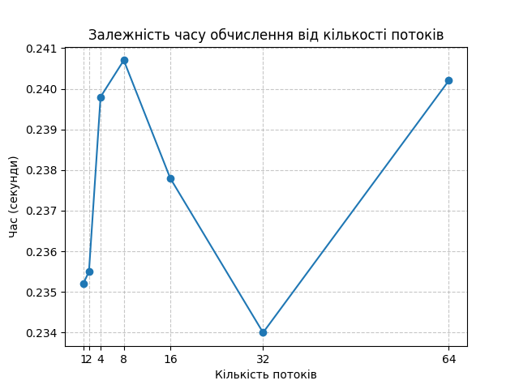

# Monte Carlo π estimation with multithreading

## Умова
Використовуючи метод Монте-Карло обчислити число π:
- у головному потоці на 1 млн точок;
- розбити обчислення на цій же кількості точок паралельними потоками (2, 4, 8, 16, 32, 64);
- заміряти час обчислення;
- не використовувати ніяких методів синхронізації, окрім `join`.

## Результати

| Кількість потоків | π (наближене значення) | Час (секунди) |
|-------------------|------------------------|---------------|
| 1 (main)          | 3.145200               | 0.2352        |
| 2                 | 3.140476               | 0.2355        |
| 4                 | 3.140500               | 0.2398        |
| 8                 | 3.142996               | 0.2407        |
| 16                | 3.141772               | 0.2378        |
| 32                | 3.142108               | 0.2340        |
| 64                | 3.141268               | 0.2402        |

## Графік

## Висновки
- Час обчислення практично не залежить від кількості потоків.  
- Це пояснюється наявністю **GIL (Global Interpreter Lock)** у Python, який не дозволяє одночасно виконувати обчислення у кількох потоках для CPU-bound задач.  
- Таким чином, використання багатопоточності не дало прискорення, але дозволило потренуватися з `threading` і розподілом задач між потоками.
